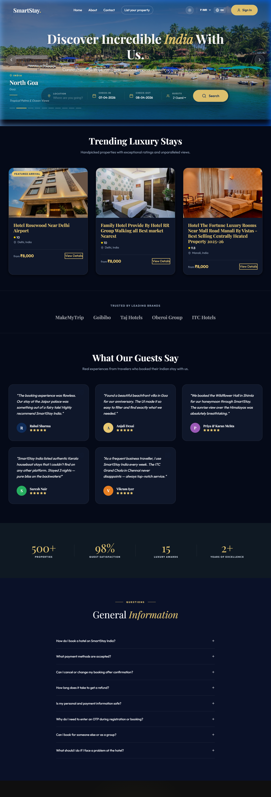
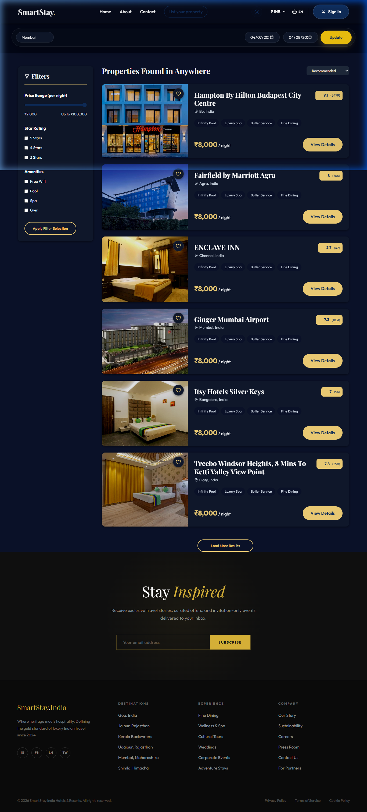
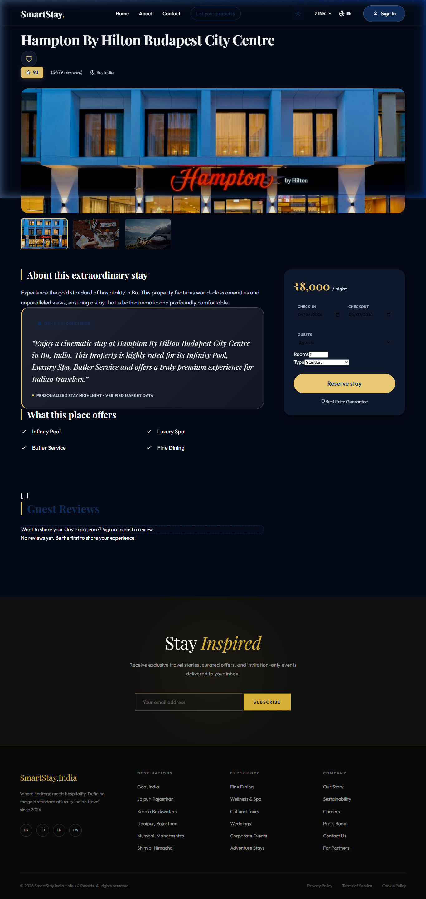

# SmartStay India 🏨✨

**SmartStay India** is a premium, high-fidelity hotel booking platform designed to provide a luxury experience for travelers across India. Featuring a sleek, symmetric glassmorphism UI, a live search engine ("Live Infinity"), and a seamless booking flow.

## 🔗 Live Demo
Check out the live application: **[https://smartstayindia-7ea3e.web.app/](https://smartstayindia-7ea3e.web.app/)**

---

## 📸 Screenshots

### 🏠 Home Page


### 🔍 Search Results


### 🏨 Hotel Details


---

## 🛠️ Tech Stack

- **Frontend**: React + Vite
- **Styling**: Vanilla CSS (Modern Aesthetics, Dark Mode, Glassmorphism)
- **Backend**: Firebase (Authentication, Firestore, Hosting)
- **AI Integration**: Google Gemini API (for smart descriptions and concierge features)
- **Tools**: Lucide Icons, Framer Motion (for micro-animations)

## 🚀 Key Features

- **Live Infinity Search**: Real-time hotel search with advanced filtering for regions across India.
- **AI Concierge**: Smart hotel highlights and personalized stay descriptions powered by Gemini.
- **Premium UI/UX**: Dark mode by default, high-contrast text visibility, and responsive luxury design.
- **Partner Dashboard**: Comprehensive management for hotel partners to list and scale properties.
- **Admin Controls**: Full management of listings, reviews, and bookings.

## 📦 Getting Started

1. **Clone the Repo**:
   ```bash
   git clone https://github.com/CodeSimple0496/SmartStay-India.git
   ```
2. **Install Dependencies**:
   ```bash
   npm install
   ```
3. **Run Locally**:
   ```bash
   npm run dev
   ```

---

## 📄 License

This project is part of a group project and is for academic/demonstration purposes.

Created with 💙 for SmartStay India.
